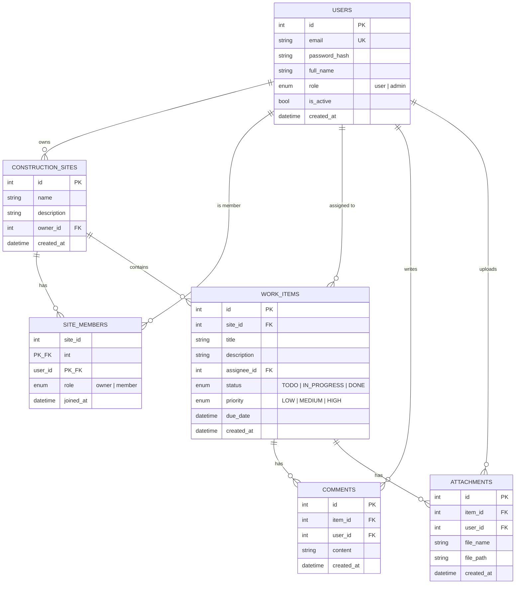

# API Quản Lý Công Trình Xây Dựng (Construction Site Management API)


Hệ thống backend RESTful phục vụ quản lý các công trình xây dựng, hạng mục công việc (tasks/work items), thành viên nhóm (team membership), bình luận (comments) và tệp đính kèm (file attachments). Dự án được xây dựng bằng **FastAPI**, **SQLAlchemy 2.x** và **Pydantic v2**, tích hợp xác thực dựa trên JWT cùng mô hình phân quyền 2 cấp độ (vai trò người dùng toàn hệ thống + vai trò thành viên theo từng công trình).

Mã định danh nội bộ của ứng dụng: `Project_FastAPI_Construction_Management` (xem tại `main.py`).

---

## Mục lục

- [Tổng quan](#tổng-quan)
- [Tính năng chính](#tính-năng-chính)
- [Công nghệ sử dụng](#công-nghệ-sử-dụng)
- [Cấu trúc dự án](#cấu-trúc-dự-án)
- [Mô hình dữ liệu (Data Model)](#mô-hình-dữ-liệu-data-model)
- [Hướng dẫn cài đặt & Chạy dự án](#hướng-dẫn-cài-đặt--chạy-dự-án)
  - [Yêu cầu tiên quyết](#yêu-cầu-tiên-quyết)
  - [Cài đặt](#cài-đặt)
  - [Biến môi trường](#biến-môi-trường)
  - [Chạy ứng dụng](#chạy-ứng-dụng)
- [Tài liệu API](#tài-liệu-api)
  - [Tài liệu tương tác (Interactive Docs)](#tài-liệu-tương-tác-interactive-docs)
  - [Xác thực & Phân quyền (Authentication & Authorization)](#xác-thực--phân-quyền-authentication--authorization)
  - [Danh sách Endpoint](#danh-sách-endpoint)
  - [Định dạng phản hồi lỗi](#định-dạng-phản-hồi-lỗi)
- [Ví dụ gọi API (Sample Requests)](#ví-dụ-gọi-api-sample-requests)
- [Giấy phép (License)](#giấy-phép-license)

---

## Tổng quan

API cho phép doanh nghiệp quản lý nhiều **công trình xây dựng (construction sites)**. Mỗi công trình có một **chủ sở hữu (owner)** và danh sách **thành viên (members)**. Trong từng công trình, người dùng có thể tạo và theo dõi các **hạng mục công việc (work items/tasks)** với trạng thái và mức độ ưu tiên, trao đổi thông qua **bình luận (comments)** và đính kèm **tệp tài liệu (files)** liên quan.

Hệ thống phân quyền được thực thi ở 2 cấp độ:

1. **Vai trò toàn cục (Global role)** — `user` hoặc `admin` (kiểm soát quyền truy cập tài nguyên toàn hệ thống, ví dụ: xem danh sách người dùng).
2. **Vai trò theo công trình (Site-level role)** — `owner` hoặc `member` (kiểm soát quyền truy cập vào một công trình cụ thể và toàn bộ dữ liệu trực thuộc).

## Tính năng chính

- Xác thực JWT với cặp token riêng biệt: **access token** và **refresh token**
- Băm mật khẩu an toàn với `bcrypt`
- Quản lý CRUD công trình xây dựng với cơ chế kiểm soát quyền theo chủ sở hữu (ownership)
- Quản lý thành viên công trình (thêm/xóa thành viên, phân quyền theo từng công trình)
- Theo dõi hạng mục công việc với trạng thái (`status`: `TODO`, `IN_PROGRESS`, `DONE`) và mức độ ưu tiên (`priority`: `LOW`, `MEDIUM`, `HIGH`)
- Luồng bình luận (threaded comments) trên từng hạng mục công việc
- Tải lên tệp đính kèm cho từng hạng mục công việc
- Chuẩn hóa định dạng phản hồi lỗi tập trung qua các custom exception handler
- Hỗ trợ linh hoạt nhiều loại cơ sở dữ liệu: SQLite, MySQL hoặc PostgreSQL

## Công nghệ sử dụng

| Tầng / Thành phần                  | Công nghệ                                            |
| ---------------------------------- | ---------------------------------------------------- |
| Web framework                      | [FastAPI](https://fastapi.tiangolo.com/)             |
| Xác thực dữ liệu (Data validation) | Pydantic v2 (`model_config = ConfigDict(...)`)       |
| ORM                                | SQLAlchemy 2.x (chuẩn `Mapped` / `mapped_column`)    |
| Xác thực (Authentication)          | JSON Web Tokens (`PyJWT`) + băm mật khẩu `argon2`    |
| ASGI server                        | Uvicorn                                              |
| Cơ sở dữ liệu                      | SQLite / MySQL / PostgreSQL (tùy chọn theo cấu hình) |
| Quản lý cấu hình                   | `python-dotenv`                                      |

## Cấu trúc dự án

```
.
├── main.py                        # Điểm khởi chạy ứng dụng FastAPI, middleware, đăng ký router
├── .env.example                   # File mẫu cấu hình biến môi trường
└── app/
    ├── core/
    │   ├── config.py               # Tải & kiểm tra hợp lệ cấu hình cài đặt (settings)
    │   ├── exception.py            # Hệ thống phân cấp custom exception & global handlers
    │   └── security.py             # Xử lý băm mật khẩu & các tiện ích JWT
    ├── db/
    │   └── database.py             # SQLAlchemy engine, session, Base, get_db
    ├── dependencies/
    │   └── auth.py                 # get_current_user / get_current_active_user / require_admin
    ├── models/                     # Các mô hình SQLAlchemy ORM
    │   ├── users.py
    │   ├── sites.py                # ConstructionSiteModel, SiteMemberModel
    │   ├── work_items.py
    │   ├── comments.py
    │   └── attachments.py
    ├── schemas/                    # Pydantic schemas cho request/response
    │   ├── auth.py
    │   ├── users.py
    │   ├── construction_sites.py
    │   ├── site_members.py
    │   ├── work_items.py
    │   ├── comments.py
    │   └── attachments.py
    ├── services/                   # Tầng xử lý logic nghiệp vụ (Business logic)
    │   ├── auth.py
    │   ├── users.py
    │   ├── sites.py
    │   ├── members.py
    │   ├── work_items.py
    │   ├── comments.py
    │   └── attachments.py
    └── routers/                    # Khai báo các route của FastAPI
        ├── auth.py
        ├── users.py
        ├── sites.py
        ├── members.py
        ├── work_items.py
        └── comments.py
```

## Mô hình dữ liệu (Data Model)



---

## Hướng dẫn cài đặt & Chạy dự án

### Yêu cầu tiên quyết

- Python 3.10+ (mã nguồn sử dụng cú pháp union theo PEP 604, ví dụ `str | None`)
- Hệ quản trị cơ sở dữ liệu tương ứng với `DB_TYPE` đã chọn: SQLite (tích hợp sẵn), MySQL hoặc PostgreSQL

### Cài đặt

- Đối Với Python

```bash
git clone <repository-url>
cd <repository-directory>

python -m venv .venv
source .venv/bin/activate

pip install -r requirements.txt
```

- Đối Với UV

```bash
git clone <repository-url>
cd <repository-directory>

uv init
uv venv
source .venv/bin/activate
uv sync
uv add -r requirements.txt
```

### Biến môi trường

Sao chép file `.env.example` thành `.env` và cập nhật các giá trị cấu hình phù hợp:

| Biến                              | Mô tả                                                                             | Ví dụ mẫu               |
| --------------------------------- | --------------------------------------------------------------------------------- | ----------------------- |
| `DB_TYPE`                         | Loại cơ sở dữ liệu: `sqlite`, `mysql`, hoặc `postgresql`                          | `postgresql`            |
| `DB_USER`                         | Tên người dùng database (bắt buộc với `mysql`/`postgresql`)                       | `app_user`              |
| `DB_PASSWORD`                     | Mật khẩu database (đồng thời dùng làm khóa mã hóa SQLCipher nếu `DB_TYPE=sqlite`) | `********`              |
| `DB_HOST`                         | Máy chủ database (bắt buộc với `mysql`/`postgresql`)                              | `localhost`             |
| `DB_PORT`                         | Cổng kết nối database (bắt buộc với `mysql`/`postgresql`)                         | `5432`                  |
| `DB_NAME`                         | Tên database / Tên file SQLite (không bao gồm phần mở rộng `.db`)                 | `construction_db`       |
| `JWT_SECRET_KEY`                  | Khóa bí mật dùng để ký token JWT                                                  | `change-me`             |
| `JWT_ALGORITHM`                   | Thuật toán ký JWT                                                                 | `HS256`                 |
| `JWT_ACCESS_TOKEN_EXPIRE_MINUTES` | Thời gian sống của access token (tính theo phút)                                  | `30`                    |
| `JWT_REFRESH_TOKEN_EXPIRE_DAY`    | Thời gian sống của refresh token (tính theo ngày)                                 | `7`                     |
| `SV_HOST`                         | Địa chỉ IP của máy chủ                                                            | `[IP_ADDRESS]`          |
| `SV_PORT`                         | Cổng của máy chủ                                                                  | `3000`                  |
| `CORS_ORIGINS`                    | Danh sách các origin được phép kết nối (phân tách bởi dấu phẩy, không dùng `*`)   | `http://localhost:3000` |
| `DEBUG`                           | Bật chế độ `echo` của SQLAlchemy (ghi log các câu lệnh SQL)                       | `False`                 |

### Chạy ứng dụng

- Đối Với Python

```bash
python main.py
# hoặc sử dụng uvicorn trực tiếp với tính năng tự động reload khi sửa code:
uvicorn main:app --reload --host [IP_ADDRESS] --port 3000
```

- Đối Với UV

```bash
uv run main
# Hoặc:
uv run fastapi dev main.py --host [IP_ADDRESS] --port 3000 --reload
```

Khi ứng dụng khởi động, câu lệnh `Base.metadata.create_all(bind=engine)` sẽ tự động tạo các bảng còn thiếu trong cơ sở dữ liệu đã cấu hình.

---

## Tài liệu API

### Tài liệu tương tác (Interactive Docs)

Sau khi khởi chạy ứng dụng, FastAPI tự động cung cấp giao diện tài liệu API trực quan:

- Swagger UI: `http://127.0.0.1:3000/docs`
- ReDoc: `http://127.0.0.1:3000/redoc`

### Xác thực & Phân quyền (Authentication & Authorization)

1. **Đăng ký** tài khoản qua endpoint `POST /auth/register`, sau đó **đăng nhập** qua `POST /auth/login` để nhận `access_token`.
2. Đính kèm token này vào header của mỗi request cần xác thực:

   ```
   Authorization: Bearer <access_token>
   ```

3. Khi access token hết hạn, gọi endpoint `POST /auth/refresh` và truyền refresh token thông qua request header `refresh-token`.

Hai cơ chế phân quyền độc lập được áp dụng bên cạnh việc xác thực người dùng:

| Cơ chế kiểm tra                                   | Thành phần kiểm soát                                             | Phạm vi áp dụng                                                                          |
| ------------------------------------------------- | ---------------------------------------------------------------- | ---------------------------------------------------------------------------------------- |
| **Vai trò toàn cục** (`user` / `admin`)           | Dependency `require_admin`                                       | Các endpoint toàn hệ thống (ví dụ: xem danh sách tất cả người dùng)                      |
| **Vai trò trong công trình** (`owner` / `member`) | `SiteService.get_site_member` / `SiteService.require_site_owner` | Toàn bộ endpoint liên quan đến công trình, hạng mục công việc, bình luận và tệp đính kèm |

### Danh sách Endpoint

**Xác thực (Auth)** — `/auth`

| Phương thức | Đường dẫn        | Mô tả                                                                     | Quyền truy cập       |
| ----------- | ---------------- | ------------------------------------------------------------------------- | -------------------- |
| POST        | `/auth/register` | Đăng ký tài khoản người dùng mới                                          | Công khai (Public)   |
| POST        | `/auth/login`    | Đăng nhập và nhận access token                                            | Công khai (Public)   |
| POST        | `/auth/refresh`  | Cấp access token mới từ refresh token (truyền qua header `refresh-token`) | Refresh token hợp lệ |

**Người dùng (Users)** — `/users`

| Phương thức | Đường dẫn   | Mô tả                            | Quyền truy cập |
| ----------- | ----------- | -------------------------------- | -------------- |
| GET         | `/users/me` | Lấy thông tin tài khoản hiện tại | Đã đăng nhập   |
| GET         | `/users`    | Lấy danh sách tất cả người dùng  | Chỉ Admin      |

**Công trình xây dựng (Construction Sites)** — `/construction-sites`

| Phương thức | Đường dẫn                       | Mô tả                                                                 | Quyền truy cập        |
| ----------- | ------------------------------- | --------------------------------------------------------------------- | --------------------- |
| POST        | `/construction-sites`           | Tạo công trình mới (người tạo tự động trở thành chủ sở hữu)           | Đã đăng nhập          |
| GET         | `/construction-sites`           | Danh sách các công trình mà người dùng hiện tại tham gia              | Đã đăng nhập          |
| GET         | `/construction-sites/{site_id}` | Xem chi tiết thông tin công trình                                     | Thành viên công trình |
| PATCH       | `/construction-sites/{site_id}` | Cập nhật tên hoặc mô tả công trình                                    | Chủ sở hữu công trình |
| DELETE      | `/construction-sites/{site_id}` | Xóa công trình (xóa xếp tầng các thành viên và công việc thuộc về nó) | Chủ sở hữu công trình |

**Thành viên công trình (Site Members)** — `/construction-sites/{site_id}/members`

| Phương thức | Đường dẫn                                         | Mô tả                                                             | Quyền truy cập        |
| ----------- | ------------------------------------------------- | ----------------------------------------------------------------- | --------------------- |
| POST        | `/construction-sites/{site_id}/members`           | Thêm một người dùng hiện có vào làm thành viên công trình         | Chủ sở hữu công trình |
| GET         | `/construction-sites/{site_id}/members`           | Lấy danh sách thành viên thuộc công trình                         | Thành viên công trình |
| DELETE      | `/construction-sites/{site_id}/members/{user_id}` | Xóa thành viên khỏi công trình (chủ sở hữu không thể tự xóa mình) | Chủ sở hữu công trình |

**Hạng mục công việc (Work Items)**

| Phương thức | Đường dẫn                           | Mô tả                                               | Quyền truy cập        |
| ----------- | ----------------------------------- | --------------------------------------------------- | --------------------- |
| POST        | `/construction-sites/{site_id}`     | Tạo một hạng mục công việc mới trong công trình     | Thành viên công trình |
| GET         | `/construction-sites/{site_id}`     | Lấy danh sách các hạng mục công việc của công trình | Thành viên công trình |
| GET         | `/work-items/{item_id}`             | Xem chi tiết hạng mục công việc                     | Thành viên công trình |
| PATCH       | `/work-items/{item_id}`             | Cập nhật hạng mục công việc (cập nhật từng phần)    | Thành viên công trình |
| DELETE      | `/work-items/{item_id}`             | Xóa hạng mục công việc                              | Thành viên công trình |
| POST        | `/work-items/{item_id}/attachments` | Tải lên tệp đính kèm (`multipart/form-data`)        | Thành viên công trình |

**Bình luận (Comments)** — `/work-items/{item_id}/comments`

| Phương thức | Đường dẫn                        | Mô tả                                     | Quyền truy cập        |
| ----------- | -------------------------------- | ----------------------------------------- | --------------------- |
| POST        | `/work-items/{item_id}/comments` | Thêm bình luận vào một hạng mục công việc | Thành viên công trình |

### Định dạng phản hồi lỗi

Tất cả các lỗi được xử lý (lỗi xác thực schema, lỗi logic nghiệp vụ và lỗi HTTP) đều trả về định dạng JSON đồng nhất:

```json
{
  "success": false,
  "error_code": "FORBIDDEN",
  "message": "Bạn không phải là thành viên của công trình này",
  "details": null
}
```

Một số thông báo lỗi nghiệp vụ hiện được viết bằng tiếng Việt, trong khi các giá trị `error_code` (ví dụ: `NOT_FOUND`, `BAD_REQUEST`, `VALIDATION_ERROR`, `UNAUTHORIZED`, `FORBIDDEN`) là các mã định danh tiếng Anh chuẩn hóa, ổn định, phục vụ việc phân nhánh xử lý ở phía client.

---

## Ví dụ gọi API (Sample Requests)

**Đăng ký tài khoản (Register)**

```bash
curl -X POST http://127.0.0.1:3000/auth/register
  -H "Content-Type: application/json"
  -d '{
        "email": "manager@example.com",
        "full_name": "Nguyen Van A",
        "password": "StrongPassword123"
      }'
```

**Đăng nhập (Log in)**

```bash
curl -X POST http://127.0.0.1:3000/auth/login
  -H "Content-Type: application/json"
  -d '{
        "email": "manager@example.com",
        "password": "StrongPassword123"
      }'
```

**Tạo công trình xây dựng (Create a construction site)**

```bash
curl -X POST http://127.0.0.1:3000/construction-sites
  -H "Authorization: Bearer <access_token>"
  -H "Content-Type: application/json"
  -d '{
        "name": "Riverside Tower",
        "description": "Tòa nhà chung cư 20 tầng"
      }'
```

**Tạo hạng mục công việc (Create a work item)**

```bash
curl -X POST http://127.0.0.1:3000/construction-sites/1
  -H "Authorization: Bearer <access_token>"
  -H "Content-Type: application/json"
  -d '{
        "title": "Đổ bê tông móng",
        "priority": "HIGH",
        "site_id": 1
      }'
```

**Tải lên tệp đính kèm (Upload an attachment)**

```bash
curl -X POST http://127.0.0.1:3000/work-items/1/attachments
  -H "Authorization: Bearer <access_token>"
  -F "file=@/path/to/ban_ve_thiet_ke.pdf"
```

---

## Giấy phép (License)

[MIT](LICENSE)

## Authors

- [Nguyễn Tuấn Dũng](https://github.com/nguyentuandungptit)
